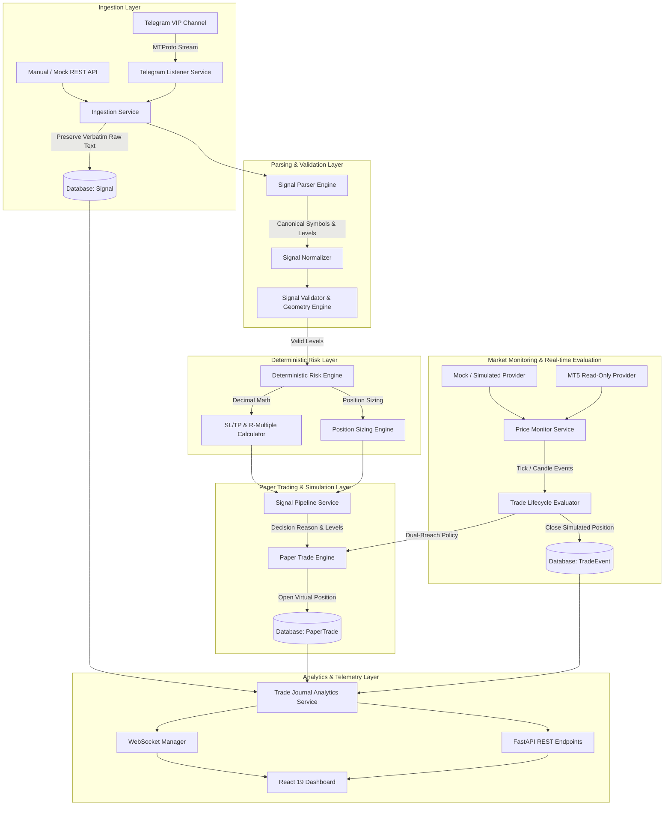

# System Architecture: Telegram Signal Paper Trading & Analytics System

## 1. System Overview

The **Telegram Signal Paper Trading System** is an end-to-end automated platform designed to ingest unstructured trading signals from VIP Telegram channels, parse and validate trade parameters deterministically, execute virtual paper trades, monitor market prices in real-time, and compute statistical trade performance metrics.

> **CRITICAL BOUNDARY**: This system is strictly designed for **Paper Trading and Statistical Analytics**. It contains zero live broker execution logic.

---

## 2. End-to-End Pipeline Architecture



---

## 3. Directory & Module Separation of Concerns

```
d:/FX/
├── backend/
│   ├── app/
│   │   ├── config/              # Pydantic BaseSettings & Environment management
│   │   ├── database/            # Async SQLAlchemy engine, session, & Base models
│   │   │   └── models/          # Signal, PaperTrade, PriceSnapshot, TradeEvent, SystemEvent
│   │   ├── telegram/            # Telethon MTProto client, filters, & ingestion schemas
│   │   ├── parser/              # Regex pattern library, state engine, canonical symbol map
│   │   ├── risk/                # Deterministic Decimal SL/TP, R-multiples, and RR validation
│   │   ├── paper_trading/       # Paper trade lifecycle, sizing models, tick evaluation
│   │   ├── market_data/         # MarketDataProvider interface, Mock & read-only MT5 adapters
│   │   ├── signals/             # End-to-end pipeline service & decision reason mapper
│   │   ├── analytics/           # Statistical computations, drawdown analyzer, provider comparison
│   │   ├── api/                 # FastAPI REST routes (v1) and WebSocket broadcast manager
│   │   └── utils/               # Masked structured logging & helpers
│   ├── tests/                   # 92+ Automated unit, integration, and failure test suites
│   ├── requirements.txt         # Python dependencies
│   └── pytest.ini               # Pytest configuration
│
└── frontend/
    ├── src/
    │   ├── components/          # Reusable UI widgets & tab views
    │   │   ├── Navbar.tsx
    │   │   ├── PaperTradingBanner.tsx
    │   │   ├── SignalDecisionCard.tsx
    │   │   ├── OverviewTab.tsx
    │   │   ├── LiveTradesTab.tsx
    │   │   ├── SignalFeedTab.tsx
    │   │   ├── TradeJournalTab.tsx
    │   │   ├── AnalyticsTab.tsx
    │   │   ├── SandboxTab.tsx
    │   │   ├── SettingsTab.tsx
    │   │   └── SignalDetailModal.tsx
    │   ├── hooks/               # useWebSocket live data hook
    │   ├── lib/                 # REST API client
    │   ├── types.ts             # TypeScript interfaces matching backend models
    │   └── App.tsx              # Main dashboard application
    ├── package.json             # React 19, TypeScript, Tailwind CSS
    └── vite.config.ts           # Vite bundler configuration
```

---

## 4. Key Architectural Guarantees

### 4.1 Zero-Assumption Stop Loss Policy
The system **never fabricates or invents a Stop Loss** for an incomplete signal. If a signal contains an entry price and direction without an explicit SL, it is marked `SKIPPED_NO_SL` or `MISSING_SL` and preserved for auditability without opening a paper trade.

### 4.2 Deterministic Decimal Mathematics
All risk distances, R-multiples ($1.0R, 1.5R, 2.0R, 3.0R$), pip distances, and P&L calculations utilize Python's `Decimal` module with explicit rounding modes (`ROUND_HALF_UP`) and instrument-specific tick sizes:
- Forex 5-digit pairs (`EURUSD`, `GBPUSD`): `0.00001` tick, `0.0001` pip
- JPY pairs (`USDJPY`): `0.001` tick, `0.01` pip
- Gold (`XAUUSD`): `0.01` tick, `0.1` pip
- Crypto / Indices (`BTCUSD`, `US30`): `0.01` tick, `1.0` pip

### 4.3 Candle Dual-Breach Ambiguity Policy
When historical or live candlestick high/low ranges simultaneously breach both Stop Loss and Take Profit levels in the same bar, the system resolves the execution according to configurable policies (`CONSERVATIVE`, `SL_FIRST`, `TP_FIRST`, `BAR_CLOSE`) and records an `AMBIGUOUS_CANDLE_EVALUATION` audit trail event.

### 4.4 Objective Statistical Reporting
The analytics engine reports observed mathematical metrics and distributions without subjective qualitative labels (such as "good" or "bad"). Drawdowns and streaks are computed strictly in chronological forward sequence to prevent lookahead bias.

---

## 5. Deployment & Configuration Guide

### 5.1 Environment Variables (`.env`)
```bash
# Telegram Configuration
TELEGRAM_API_ID=12345678
TELEGRAM_API_HASH=abcdef0123456789abcdef0123456789
TELEGRAM_SESSION=paper_trading_session
TELEGRAM_SOURCE_CHAT_ID=-1001234567890
TELEGRAM_PHONE=+1234567890
TELEGRAM_MOCK_MODE=false

# Database Configuration
DATABASE_URL=sqlite+aiosqlite:///./paper_trading.db

# Risk & SL/TP Rules
DEFAULT_TP_R_MULTIPLE=2.0
ALTERNATIVE_TP_R_MULTIPLES=[1.0, 1.5, 2.0, 3.0]
MIN_RR=1.5
PAPER_TRADING_ENABLED=true

# Market Data & Execution Policy
MARKET_DATA_PROVIDER=simulated
CANDLE_EXECUTION_POLICY=CONSERVATIVE
```

### 5.2 Running Locally
```powershell
# 1. Backend Server
cd d:\FX\backend
venv\Scripts\uvicorn app.main:app --host 127.0.0.1 --port 8000 --reload

# 2. Frontend Dashboard
cd d:\FX\frontend
npm run dev
```

